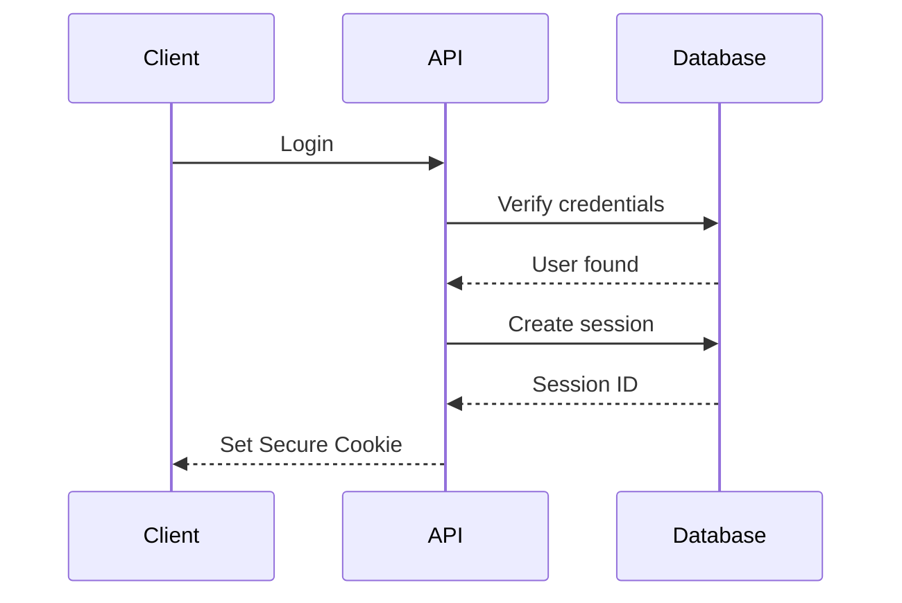
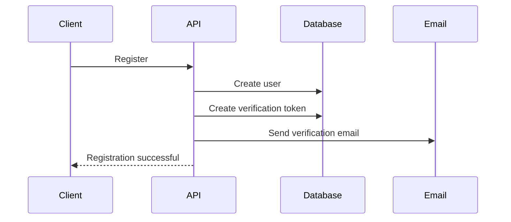
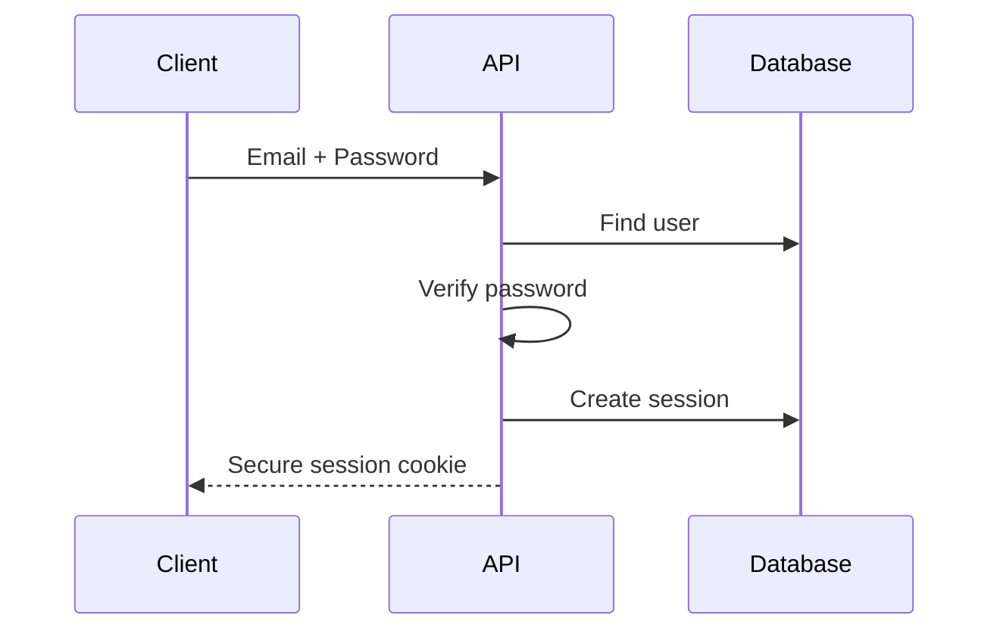
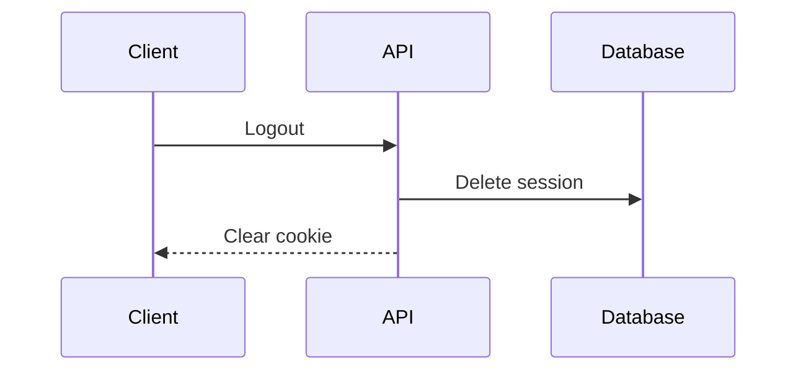

# AUTHENTICATION.md

# Authentication & Authorization

> This document defines the authentication and authorization architecture of the Ecommerce Backend API. It describes how users authenticate, how sessions are managed, how permissions are enforced, and the security requirements of the system.

---

# Overview

The Ecommerce Backend API uses **session-based authentication**.

Authentication identifies the user.

Authorization determines what the authenticated user is allowed to do.

All authentication state is maintained on the server.

---

# Authentication Strategy

The system uses:

- Session-based authentication
- Secure HTTP-only cookies
- Server-side session storage
- Session expiration
- Session revocation
- Email verification
- Password hashing

The API does **not** use:

- JWT Access Tokens
- JWT Refresh Tokens
- OAuth
- Social login

These may be added in future versions.

---

# Authentication Flow

---

# Session Lifecycle

A session is created after:

- Successful login

A session is destroyed after:

- Logout
- Password change (optional: revoke all sessions)
- Session expiration
- Idle timeout (no authenticated request within `SESSION_IDLE_TIMEOUT_MS`)
- Administrative revocation

---

# Session Storage

Each authenticated session contains:

- Session ID
- User ID
- Session token
- Device information
- User agent
- IP address
- Last activity
- Created at
- Expires at

The server validates the session on every authenticated request.

---

# Session Cookie

Authentication uses a secure cookie.

Recommended settings:

- HTTP Only
- Secure
- SameSite=Lax (or Strict where appropriate)
- Signed
- Expiration date

Session identifiers must never be exposed in API responses.

---

# Authentication Middleware

Protected endpoints require the authentication middleware.

Responsibilities:

- Read session cookie
- Validate session
- Verify expiration
- Verify idle timeout
- Load authenticated user
- Attach user to request context

If authentication fails:

- Return HTTP 401 Unauthorized

---

# Session Idle Timeout

Sessions have an absolute TTL (`SESSION_TTL_MS`, 30 days by default) **and** an idle timeout (`SESSION_IDLE_TIMEOUT_MS`, 30 days by default).

The authentication middleware records `last_activity_at` on every authenticated request (`touchSession`). If a session's `last_activity_at` is older than `SESSION_IDLE_TIMEOUT_MS` — i.e. the session has not been used within the idle window — the request is rejected with **401** even if the absolute TTL has not yet elapsed.

Semantics:

- **Absolute expiry**: `expires_at` is fixed at login and never extended; a session dies at most `SESSION_TTL_MS` after creation.
- **Idle timeout**: `last_activity_at` slides forward on every authenticated request; an idle session is rejected once the idle window passes without activity.
- The effective session lifetime is `min(absolute TTL, last activity + idle timeout)`.

Operators can shorten `SESSION_IDLE_TIMEOUT_MS` in `src/shared/constants/session.ts` to force less-active sessions to re-authenticate. Idle rejection does **not** revoke the session row; expired/revoked rows are removed by the session cleanup job (see `docs/OPERATIONS.md`).

# CSRF Protection

Cookie-authenticated write requests are protected against cross-site request forgery using the **Double Submit Cookie** pattern (`csrf-csrf`).

Flow:

1. Client authenticates (`POST /auth/register` or `/auth/login`).
2. Client fetches a token via `GET /api/v1/auth/csrf-token`. The API sets an HttpOnly `x-csrf-token` cookie and returns the token in the response body.
3. Client sends the token on every protected write in the `x-csrf-token` header.
4. The server recomputes the token's HMAC against the session and rejects mismatches with **403**.

Rules:

- Only non-safe methods (`POST`, `PATCH`, `PUT`, `DELETE`) that carry a session cookie are validated.
- Requests without a session cookie are skipped — this covers the pure public writes (`/auth/register`, `/auth/login`, `/auth/password-reset`, `/auth/password-reset/verify`, `/auth/email-verification/verify`) which rely on body credentials/tokens rather than the session.
- Tokens are bound to the session cookie value; re-authentication invalidates previously issued tokens.
- Index of the token endpoint contract: `docs/api/authentication/csrf.md`.

---

# Authorization

Authorization occurs after authentication.

Authentication answers:

> Who is the user?

Authorization answers:

> What is the user allowed to do?

---

# Roles

Current roles:

- Customer
- Administrator

Future roles may be added without changing the authentication architecture.

---

# Authorization Middleware

Responsibilities:

- Verify user role
- Verify ownership
- Enforce permissions

Example:

Customer

- Manage own profile
- Manage own addresses
- Manage own orders
- Manage own cart
- Submit reviews

Administrator

- Manage users
- Manage products
- Manage categories
- Manage inventory
- Manage orders
- Moderate reviews

---

# Registration Flow

---

# Email Verification

A newly registered account must verify its email address.

Verification flow:

1. Generate verification token
2. Store token securely
3. Send verification email
4. User opens verification link
5. Verify token
6. Mark account as verified
7. Invalidate token

Verification tokens are single-use.

---

# Login Flow

---

# Logout Flow

---

# Password Reset

Password reset flow:

1. Request reset
2. Generate secure reset token
3. Store hashed token
4. Send reset email
5. Validate token
6. Update password
7. Delete reset token
8. Optionally revoke all active sessions

Reset tokens:

- Single use
- Expire automatically
- Cryptographically secure

---

# Change Password

Authenticated users may change their password.

Requirements:

- Verify current password
- Validate new password
- Hash new password
- Update password
- Optionally revoke all other sessions

---

# Session Management

Users can:

- View active sessions
- View current session
- Revoke individual sessions
- Revoke all other sessions

The current session cannot accidentally revoke itself unless explicitly requested.

---

# Protected Endpoints

Endpoints requiring authentication include:

- Profile
- Addresses
- Cart
- Checkout
- Orders
- Reviews
- Session management

Public endpoints remain accessible without authentication.

---

# Public vs Internal Identifiers

Clients interact only with public identifiers.

Internal database IDs remain private.

Authentication resolves public identifiers into internal IDs where necessary.

---

# Security Requirements

The authentication system must implement:

- Password hashing (Argon2 or bcrypt)
- Secure random session IDs
- HTTP-only cookies
- Secure cookies in production
- SameSite protection
- Session expiration
- Session idle timeout
- Session revocation
- CSRF protection where appropriate
- Rate limiting
- Input validation
- Output sanitization

Sensitive authentication data must never be logged.

---

# Error Responses

Authentication errors:

- 400 Bad Request
- 401 Unauthorized
- 403 Forbidden
- 409 Conflict
- 422 Unprocessable Entity

Responses must never reveal whether an email address exists unless explicitly intended.

---

# Future Extensions

The architecture should support future additions such as:

- Multi-factor authentication (MFA)
- OAuth providers
- Social login
- Passwordless authentication
- WebAuthn / Passkeys
- Device trust
- Session analytics

These additions should not require major architectural changes.